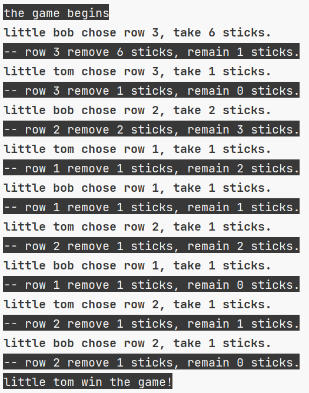

# PickUpSticks Game
pick up sticks game in csharp

## 规则
> 15个任意物品（可以是火柴牙签poker） 以下按牙签为例。
> 将15根牙签 分成三行 每行自上而下（其实方向不限）分别是3、5、7根。
> 安排两个玩家，每人可以在一轮内，在任意行拿任意根牙签，但不能跨行。
> 拿最后一根牙签的人即为输家。

## 抽象
1. Stick: 选择物品 **木棍** 
2. SticksRow: 这些木棍是按行来摆放的，所以我们把这一行木棍也作为一个抽象，即 **木棍行**。木棍行应该包含一堆木棍和一个行标识。
3. SticksRowPanel: 玩家是在由木棍行组成的平面内选取木棍，所以我们还需要对该平面进行抽象，即**木棍行面板**。我们在木棍行面板上可以放置许多木棍行。
4. Player: 我们应该为 **玩家** 赋予一个名字用于标识。玩家每轮必须在任意行（不跨行）一次性拿不少于 1 根木棍，才能使游戏正常结束。
5. Game: 该游戏需要两名玩家参与，在木棍行面板上抽取木棍，拿最后一根牙签的人即为输家
6. GameLogger: 在进行游戏时，我们需要 **游戏日志记录器** 对玩家操作进行记录 便于查阅

## 创建项目
1. 创建 PickUpSticks 解决方案
2. 创建 PickUpSticks Console Application 项目 重命名 Program.cs 为 StartPoint.cs 并使用 top-level-statement 重写
3. 创建 PickUpSticksTests Class Library 项目

## TDD
原则：要想实现什么功能，先写什么测试。

下面以 Stick 对象的创建为例子 介绍实现过程（使用 Jetbrains Rider）
1. 选择 PickUpSticksTests 项目
2. 利用快捷键快速创建 StickTests 类
3. 利用自定义的 live template 快速创建第一个测试方法
4. 在方法中创建 Stick 并验证其不为 NULL 此时编译不通过 利用快速修复功能自动在该文件中创建类 Stick
5. 运行测试 测试通过
6. 运用重构工具将该 StickTests.cs 文件中的 Stick 类移动到 PickUpSticks 项目

全程无需用到鼠标

## RUN
程序运行入口在 StartPoint.cs 运行示例

## TODO
- [ ] 美化日志输出 使其更直观
- [ ] 写一个前端项目在线演示玩家选取木棍的全过程
